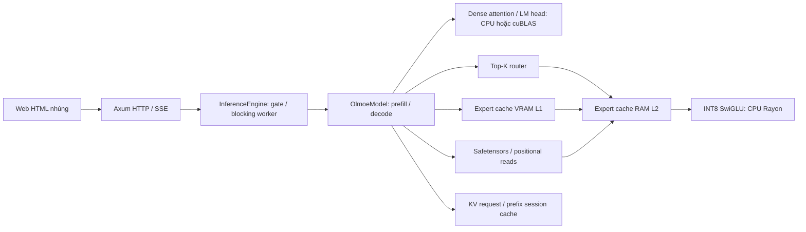

# Kiến trúc hiện tại

Mô tả mã hiện có; invariant mong muốn không đồng nghĩa đã được bảo đảm. Phát hiện gốc: [review R1–R9](reviews/2026-10-22-system-review.md); trạng thái vá hiện hành ở [PLAN](PLAN.md).


```mermaid
flowchart LR
    UI[Web HTML nhúng] --> HTTP[Axum HTTP / SSE]
    HTTP --> Engine[InferenceEngine: gate / blocking worker]
    Engine --> OLMoE[OlmoeModel: prefill / decode]
    OLMoE --> Dense[Dense attention / LM head: CPU hoặc cuBLAS]
    OLMoE --> Router[Top-K router]
    Router --> RAM[Expert cache RAM L2]
    RAM --> Compute[INT8 SwiGLU: CPU Rayon]
    OLMoE --> VRAM[Expert cache VRAM L1]
    VRAM --> RAM
    OLMoE --> Files[Safetensors / positional reads]
    Files --> RAM
    OLMoE --> KV[KV request / prefix session cache]
```

## Ranh giới module

| Module | Trách nhiệm | Invariant khi sửa |
| --- | --- | --- |
| `src/main.rs` | HTTP/status/control, SSE serialize, HTML nhúng | 400/429 trước SSE; lỗi sau headers thành error event; DONE một lần |
| `src/engine.rs` | API thư viện, một request OLMoE, spawn_blocking, queue/cancel | Không block Tokio; hủy/timeout nhả permit; snapshot có thể cũ |
| `src/olmoe.rs` | Load/config, prefill/decode, RoPE/KV/route, caches/metrics | Causal positions, reduction xác định, budget tất cả buffer, model dùng lại sau lỗi |
| `src/int8_expert.rs` | Merged layout/scales, payload recycling, CPU SwiGLU | Shape/scales hợp lệ, không mở rộng toàn expert FP32 |
| `src/safetensors.rs` | Header/offset/shape/overlap, đọc theo nhu cầu | File bất biến sau index, kiểm budget trước allocation khi API có budget |
| `src/backend.rs` | Dense/norm/softmax/attention CPU, Rayon | Tolerance fixture, finite input/output, threads thực |
| `src/gpu.rs` | CUDA/cuBLAS FFI, matrix/pinned/pool/cache | Allocation length không giả mạo, context/lifetime/drop order, scratch đồng bộ/fallback |
| `src/model/`, attention/expert/moe/memory/router/tokenizer | Tiny/reference building blocks | Không nhầm tiny format với OLMoE |
| `src/generation.rs` | Kết quả/metrics và tiny generation | Token count, finish reason, định nghĩa throughput |

Expert có thể tìm RAM trước, tải từ VRAM về host, rồi fallback file. **L1/L2 mô tả tầng lưu trữ**, không khẳng định thứ tự tra cứu hoặc expert compute trên GPU. SwiGLU hiện chạy CPU; dense GPU giữ bản weights CPU cho fallback.

Mặc định `MOE_EXPERT_CACHE_POLICY=victim`: expert đang ở RAM không upload bản sao lên VRAM; khi evict RAM, upload victim trước khi thu hồi host buffer. Admit trở lại RAM xóa bản sao L1 và trả slot sau khi download đồng bộ đã xong. Nếu expert không vừa L2, L1 vẫn có thể giữ nó. `inclusive` giữ hành vi cũ để đối chứng. Đổi policy qua `POST /api/cache/reset?expert_cache_policy=victim|inclusive` chỉ khi model idle, cùng model lock với reset; request không query giữ policy hiện hành. Không đổi thứ tự route/reduction hoặc trọng số.

## Request và bộ nhớ

1. Validate messages/model/session/context; gate trả WouldBlock/429 nếu OLMoE bận.
2. Blocking worker render template/tokenize; streaming báo ready sau validation.
3. Prefill theo layer/gom route expert, token của mỗi expert xử lý lần lượt. Candidate dispatch nhóm token chỉ còn ở cfg(test) vì A/B i5 cho thấy chậm hơn. Decode dispatch expert song song rồi cộng theo Top-K. Delta qua bounded queue; disconnect/deadline hủy hợp tác.
4. Text/token IDs/finish/metrics trả về. Prefix KV có thể giữ theo session; client vẫn gửi toàn lịch sử. Khi lượt mới khác phần cuối hoặc ngắn hơn, giữ longest common token prefix và truncate KV theo đúng vị trí causal; luôn prefill ít nhất token cuối vì session không lưu logits. Chỉ cấp KV mới nếu không có prefix dùng lại, tránh cấp bộ buffer tạm trước lookup.

Non-stream chưa hủy worker theo disconnect. Status khi suy luận có thể là snapshot cũ. Frontend chỉ commit history/metrics sau terminal+DONE và EOF hợp lệ; error/abort không commit, reader được cancel/release. Routing/VRAM placement hiển thị là minh họa, không dùng làm trace token.

Dense host/GPU, pool/scratch, L2 cache, recycled/inflight, KV capacity và tokenizer là vùng riêng. Cache limit không phải tổng RSS. Session admission/eviction tính capacity keys/values, token IDs, vector KV, SessionState và session ID; chưa gồm HashMap buckets/allocator metadata hoặc KV của request đang chạy. Metric `kv_cache_bytes` vẫn là logical keys/values bytes của request, không phải toàn bộ allocation session. Cache expert và recycled pool dùng chung ngân sách capacity mỗi layer; status báo recycled_bytes riêng. Prefill chỉ prefetch tối đa topK experts, phần còn lại đọc khi cần. Active expert payload có headroom riêng tối đa (topK+2) × bytes/expert, bao gồm decode ready/miss và lookahead2 hoặc prefill preloaded+expert đang xử lý; chưa gồm metadata, scratch/dense/KV/pinned staging và không phải tổng RSS. Reset xóa session/expert entries và recycled buffers nhưng giữ ngân sách KV để lượt sau tiếp tục lưu session. VRAM report thiếu physical pool/scratch; `expert_bytes_read` trộn file/PCIe. Timer I/O/compute chồng lấn không cộng thành wall time. Theo dõi trong PLAN trước khi dùng số liệu.

PinnedBuffer sở hữu pointer/length private, allocation portable không rỗng và không quá isize::MAX; host bytes được zero-init trước khi có slice. Getter chỉ đọc kích thước thật. Typed slice vẫn unsafe: caller chịu trách nhiệm validity/alignment của T, aliasing và đồng bộ DMA; giữ driver sống đến Drop. Upload kiểm kích thước staging bằng checked arithmetic, fallback host slices khi buffer quá nhỏ. Đây là invariant pinned buffer đã kiểm, không phải tuyên bố an toàn toàn bộ CUDA API.

Metrics mới tách `prefill_expert_io_ms`/`decode_expert_io_ms`, `expert_file_read_ms`, `expert_vram_download_ms`, `expert_vram_upload_ms` cùng payload/load counters. File timer là wall của đường load/prefetch (gồm scheduling), không phải riêng thời gian syscall; upload gồm đường staging/upload và không nằm trong legacy `expert_io_ms`. File payload đếm các load thành công, gồm speculative chưa dùng; không phải physical SSD bytes. HTTP runner ghi delta `/proc/<pid>/io:read_bytes` riêng. Không cộng các timer chồng lấn hoặc suy băng thông thiết bị từ payload/timer này.

## Hướng thay đổi

Sửa invariant với hồi quy trước, rồi tách accounting/telemetry khi cần. Chưa chia crate/di chuyển `olmoe.rs` hoặc `gpu.rs` trong lượt chuẩn hóa; refactor lớn cần PR riêng giữ API và fixture parity để không trộn thay đổi kiến trúc với bug fixes.


## Bảo vệ RAM hợp tác (đang kiểm ổn định)

Server không override cache dùng64MiB/layer cố định, không tăng theo MemAvailable. Model load kiểm kế hoạch dense decoded FP32 + toàn bộ cache cấu hình +256MiB session + working request estimate +512MiB overhead trước khi đọc weights lớn. Dense bytes trên status là số bytes weights thực đã load, không còn hardcode dense budget3GiB. Estimate không thay allocator/RSS profiler.

Guard mặc định RSS limit=min(6GiB,1/2 RAM hiệu dụng), system headroom=min(1GiB,1/8 RAM hiệu dụng); MOE_RAM_LIMIT_BYTES/MOE_RAM_HEADROOM_BYTES override bằng byte dương. Linux đọc VmRSS/MemAvailable và cgroup-v2 memory.max/current nếu nhìn thấy; ancestor constraints ngoài namespace/cgroup-v1 hoặc thiếu /proc chưa được bao phủ đầy đủ. Không có telemetry thì cảnh báo, không tuyên bố bảo vệ toàn nền tảng.

Generation kiểm reserve trước tokenization/clone/scratch, sau đó lấy mẫu tối đa mỗi25ms tại cancellation boundaries (cancel vẫn kiểm mọi lần). Áp lực RAM trả OutOfMemory: trước SSE là503, sau ready là generation_error; worker bỏ session/cache/recycled host sau khi ngừng dùng. Giữ dense và VRAM cache, không force allocator trả trang; retry chỉ thành công nếu headroom thực đủ. Guard là kiểm hợp tác, có thể overshoot giữa samples/cấp phát/driver khác, không phải hard RSS cap và chưa chứng minh hết leak/OOM. `logits()` chẩn đoán trực tiếp chưa dùng wrapper generation này.

Status bổ sung limit/headroom, session capacity/budget, VmSwap và MemAvailable; khi model bận status có thể là snapshot cũ. Đo ổn định dùng sampler /proc độc lập và watchdog, không dựa vào polling status như peak RSS.

### Vòng đời bộ nhớ request (rà tĩnh 04/11/2026)

| Vùng | Ownership/lifetime xác định từ mã | Giới hạn accounting |
| --- | --- | --- |
| KV dùng lại đúng session | take_prefix_kv remove state khỏi sessions, truncate length nhưng giữ capacity rồi chuyển KV vào request | Khi đang chạy, state không còn nằm trong tổng session status |
| KV phiên mới | Cấp theo context_limit sau lookup không dùng lại được; các session khác vẫn có thể còn sống | KV request có thể cùng tồn tại KV các phiên được giữ; admission/eviction diễn ra sau generation |
| Admission session | KV chuyển vào SessionState; evict session cũ tới khi vừa budget, rồi insert. State quá budget bị drop | Tổng cuối request không phải peak trong request, chưa gồm HashMap buckets/allocator |
| StepScratch và buffer prefill | StepScratch local trong generate_inner; batch Q/K/V, contributions và các buffer prefill local trong prefill | Drop khi thoát scope thành công/lỗi, không nằm trong session capacity |
| Tokenizer phục vụ SSE | Bản clone và decoder local theo request streaming | Chưa có allocation trace cho nội bộ clone; không suy lượng RSS từ tên thao tác |
| Lỗi OutOfMemory | Sau khi generate_inner trả lỗi và local đã ra scope, wrapper xóa sessions/cache/recycled host | Drop trả ownership cho allocator, không bảo đảm RSS giảm hoặc OS thu hồi ngay |

Đây là rà source, chưa đo byte cấp phát/giải phóng theo mốc hoặc chứng minh nguyên nhân RSS tăng. Muốn tách phần live allocation với allocator giữ trang cần quan sát riêng sau lookup KV, sau prefill, trước/sau session admission và sau generate_inner trả về; không suy ra từ một snapshot cuối request hoặc thêm malloc_trim như bản vá khi chưa có bằng chứng.

Runner RAM/HTTP hiện ghi telemetry reclaim/swap/PSI và cgroup của child trong `memory.jsonl`, không đổi guard engine. Schema, đơn vị và phạm vi namespace ở [SCENARIOS3.4](../benchmarks/SCENARIOS.md#34-đọc-telemetry-reclaim-mới-04112026). Dữ liệu mới hỗ trợ phân biệt reclaim với allocation; chưa xác định tác nhân swap của lượt cũ.

### Trace capacity theo mốc request (05/11/2026)

`MOE_MEMORY_TRACE=on|off` chọn tại load, mặc định off; giá trị sai báo lỗi. Khi tắt không quét capacity hoặc đọc RSS tại các mốc này. Khi bật, metrics của Generation thành công có `memory_trace`; `/experts` có `memory_trace_enabled` và `last_memory_trace` của request đã kết thúc (kể cả lỗi). Status khi busy vẫn có thể là snapshot cũ. Reset xóa last trace, giữ chế độ và ngân sách như trước. Trace chỉ giữ số liệu, không giữ tham chiếu/ownership của KV, scratch hay expert.

Bảy mốc thành công: before_request, after_kv_lookup (trước cấp StepScratch), prefill_buffers_live (các buffer chính đã cấp, trước vòng layer), after_prefill (buffer local đã ra scope), before_session_admission, after_session_admission và after_generate_inner (mọi local của inner đã ra scope). Lỗi có thể dừng sớm; OutOfMemory thêm after_error_cleanup sau khi xóa host cache/session/recycled. Không tạo Generation thành công để biểu diễn lỗi; trace lỗi đọc qua status. Đây là các boundary, không phải peak allocator hoặc mọi thời điểm ở từng layer/expert.

Mỗi sample ghi elapsed_ms tính từ wrapper, RSS/VmSwap byte (null nếu không đọc được), dense decoded weight payload, expert cache/recycled capacity, retained session capacity, active KV (keys/values và backing Vec<Kv>), StepScratch và các vector prefill chính. `retained_kv_capacity_bytes` là phần nằm trong retained_session_capacity_bytes, chỉ dùng phân tích ownership, không cộng lại vào `tracked_host_bytes`. KV đã chuyển vào session hoặc đã bị drop không còn tính ở active; sessionless KV vẫn active sau admission cho tới khi inner kết thúc.

`tracked_host_bytes` cộng dense payload và các capacity được liệt kê, không phải RSS/budget mới/hard cap. Chưa bao phủ tokenizer/clone/encoding, request token/text/output, container metadata ngoài accounting session hiện có, allocator bookkeeping/trang giữ lại, trace tự thân, index/heat/transitions hoặc GPU/driver/pinned và mọi expert tạm giữa các mốc. Prefill đếm batch/hidden/QKV/norm/context/projected/contributions và expert_uses, chưa bao phủ mọi allocation sâu bên trong loader/kernel. Không lấy RSS trừ tổng này để kết luận leak hoặc gán riêng vùng chưa tính. Không đổi guard/admission, thứ tự tính toán, routing/reduction hay chính sách cache.

### Candidate tái sử dụng buffer KV (05/11/2026)

`MOE_KV_BUFFER_REUSE=on|off` chọn tại load, mặc định off, giá trị sai bị từ chối. Chỉ điều khiển tái sử dụng vùng cấp phát khi không có prefix hợp lệ; valid prefix KV vẫn được dùng lại ở cả hai mode. Đường mặc định/fallback giữ thời điểm cấp KV/admission như bảng lifetime phía trên.

Khi bật, cùng session nhưng prefix0 có thể clear length keys/values và dùng lại buffers của chính nó; không dùng nội dung cũ làm KV hợp lệ. Với ID mới, candidate chỉ lấy từ session LRU khi:

- Ngay cả lower bound state mới cộng phần đang giữ cũng vượt session budget; không lấy cache khi còn chỗ hoặc request không có session.
- Donor có đúng số layer và từng buffer đủ capacity cho context hiện tại; không mượn donor thiếu capacity.
- Metadata chuẩn bị của ID/token buffer và KV donor tính chính xác vẫn vừa budget sau khi loại đúng một donor. Token buffer được reserve trước theo giới hạn sinh, tránh tăng capacity làm admission vượt dự tính; nếu EOS sớm, capacity token này có thể lớn hơn đường cũ và vẫn được tính đầy đủ vào budget. Nếu cần hơn một evict hoặc donor quá lớn thì fallback, không tạo pool ngoài ngân sách.

Map bỏ ID cũ trước khi clear/ghi đè; KV chuyển sang ownership của request, không có alias với session cũ. Clear length không zero toàn bộ capacity nhưng mọi vị trí sử dụng được ghi lại trước attention; prefix0 bảo đảm recompute từ đầu. Các session khác giữ nguyên; admission cuối vẫn kiểm budget thực và dùng LRU như cũ. Không đổi weights/router/reduction, không thêm unsafe/dependency hoặc nới guard.

Evict sớm có tác động có chủ đích: nếu request mới hủy/lỗi sau handoff, ID cũ đã mất KV cache và không được phục hồi bằng buffer đã ghi đè. Retry phiên cũ phải recompute từ lịch sử client gửi đầy đủ. Buffer request ra scope được drop; OOM vẫn áp cleanup host hiện hành. Đây là thay đổi trạng thái cache, không thay nội dung hội thoại hoặc dùng chéo KV. Candidate còn off mặc định để đối chứng trước khi chốt cấu hình vận hành.

Metrics có `kv_buffer_reuse`: enabled, reused_capacity_bytes (KV và backing Vec<Kv>), early_evicted_sessions, source (`same_session_reset`/`evicted_session`/null). Prefix hợp lệ chỉ báo qua cached_prompt_tokens như trước, không tăng counter candidate. Status có kv_buffer_reuse_enabled và last_kv_buffer_reuse của request kết thúc kể cả lỗi; reset xóa last counters, giữ mode. Các counter không chứa ID hoặc địa chỉ buffer. Fixture MHA/GQA kiểm pointer reuse, logits tolerance2e-5, budget/LRU và hủy/lỗi/retry. Cặp model thật05/11 đã xác nhận handoff và capacityKV256→128MiB/outputHTTP2/2khớp; RSS có tín hiệu thuận lợi nhưng một cặp chịu pressure khác, chưa chứng minh mức giảm tổng quát/hếtOOM hoặc speedup.


## Điều khiển và đo lookahead (03/11/2026)

`MOE_LOOKAHEAD_PREFETCH=on|off` chọn tại load, mặc định on, giá trị khác báo lỗi. Chỉ điều khiển dự đoán expert lớp kế tiếp ở decode; giữ cập nhật transition/heat, nạp theo nhu cầu và nạp trước expert đã biết trong prefill. `/experts` và metrics báo `lookahead_enabled`; reset không đổi chế độ.

Metrics request bổ sung `lookahead` với đề xuất/tải thành công/lỗi/được chọn/không dùng/bỏ khi lỗi/còn chờ, payload byte thành công và capacity buffer đỉnh. Payload còn chờ bị drop khi step lỗi, ghi cảnh báo và accounting abandoned trong profile; HTTP lỗi không trả một Generation thành công có metrics. `decode_expert_active_peak_bytes`/`decode_expert_host_peak_bytes` là mẫu capacity payload tại mốc decode, host gồm cache+recycled và active; không gồm prefill/dense/KV/scratch/pinned/metadata/allocator, không thay RSS hay hard cap. Budget/dự phòng không tăng khi bật lookahead. Thiết kế/lệnh đối chứng duy nhất ở [SCENARIOS mục3.1](../benchmarks/SCENARIOS.md#31-thiết-kế-đối-chứng-prefetch-dự-đoán-03112026).


## Chọn CPU trước khởi tạo GPU (04/11/2026)

`MOE_GPU_MODE=auto|cpu` được đọc trước load, mặc định auto. API typed `OlmoeModel::load_with_gpu_mode` và `InferenceEngine::load_with_gpu_mode` cho phép caller truyền `GpuMode` trực tiếp; hai example benchmark áp lựa chọnCLI qua API này. CPU tạo tier không có driver/device/budget, bỏ probeCUDA và không tạo denseVRAM/pool/pinned. `/experts.gpu_mode_at_load` ghi lựa chọn ban đầu. GPU toggle/set không khởi tạo muộn khi đã chọnCPU; cần restart bằng auto. Auto giữ đường probe/fallback hiện có.

RunnerHTTP/RAM pin MOE_GPU_MODE theo --gpu và kiểm trạng thái trước sinh. CPUmode của lượt cũ khác CPU trướcload; protocol lookahead mới làv2. Không suy bỏGPUinit đã chữa nguyênnhânswap nếu chưa kiểmRAM có giám sát.


## Lý do không kích hoạt lookahead

Metrics request có evaluated_layers/no_next_layer, histogram miss chỉ ở lớp có lớp kế tiếp, blocked_by_misses và disabled_eligible_layers. Điều kiện “không có demand miss” và cửa sổ tối đa2 không đổi. prediction_calls chỉ tăng khi thực sự gọi predictor; không chấm điểm shadow khi bị chặn/tắt. Phân loại positive candidates thành in_ram/in_vram/available theo cùng thứ tự lọc cũ; no_positive_score_calls và all_candidates_cached_calls phân biệt hai lý do không có đề xuất. Bộ đếm không thay route, cập nhật heat/transition, admission hoặc thứ tự cộng kết quả. Runner kiểm tổng nhất quán trước khi nhận request/cặp. Định nghĩa và giới hạn ở SCENARIOS3.2; lỗi/hủy giữa request không tạo metric hoàn tất hồi tố.

### Allocator và thread trong memory trace (08/11/2026)

MemoryStageSample bổ sung additive `thread_id` và `allocator`; schema_version1 và các trường capacity cũ giữ nghĩa. Chỉ thu khi memory trace bật, sau kiểm tra early-return; không thêm allocator guard/policy mới.

`thread_id` đọc Linux /proc/thread-self, null nếu thiếu/ngoàiLinux; đây là thread gọi boundary, không phải danh sách workerRayon. `allocator.status` là glibc_mallinfo2, symbol_unavailable hoặc unsupported_platform. Trường libc_version có khiLinuxGNU; preload_env_present chỉ báo biếnLD_PRELOAD hiện diện, không chứng minh activeallocator hay mọiinterposition.

TrênLinuxGNU, dlsymRTLD_DEFAULT tra mallinfo2 một lần quaOnceLock; không liên kết trực tiếp symbolGLIBC_2.33 nên libcGNU thiếuAPI có thể báo unavailable. ABIrepr(C) gồm đúng10size_t nhưmalloc.h, fn trảstruct byvalue; symbol và versionstring thuộc processlibc, không giữpointer vàoheaparena, không free/mutateallocator. Tính tương thích nền tảng khác chỉ là cfgfallback, chưa kiểm chạy trên mọiOS/libc. NgoàiGNU/Linux không gọiGNUFFI.

Allocator fields đều Option/byte: arena_bytes, in_use_bytes(uordblks), free_bytes(fordblks), mmap_bytes(hblkhd); null khiunavailable, không thay bằng0. query_ns đo thời gian chính lời gọi mallinfo2, không gồm /proc/capacityscan/serialize/dlsyminit/versionclone và toàn traceoverhead. Các phép đo này tự có allocation/overhead, không cam kết<1ms.

in_use_bytes+mmap_bytes là chỉ báo bookkeepingallocator, không exactliveRustpayload. Tcache/metadata/nonmallocmapping/interposition/cácarenađọc tuần tự giới hạn diễn giải. RSS và allocator không snapshotđồngthời, không cộng hai nguồn vào tracked_host_bytes; trackedcapacity cũ không gồm chỉbáoallocator để tránhđếmtrùng. Không gọi mallopt/malloc_trim hoặc đổi routing/session/cachebudget. Phép đo cũ không có trường mới không được điền hồi tố.

## Đánh giá khoa học: Perplexity & Cross-Entropy Loss

Nhằm phục vụ đánh giá định lượng học thuật cho đồ án (thay thế hoàn toàn các bài kiểm tra heuristic chuỗi con 12 câu), engine tích hợp bộ đo lường chất lượng mô hình chuẩn hóa dựa trên xác suất tự hồi quy (Autoregressive Logits Evaluation).

### 1. Cơ sở toán học
Cho một chuỗi văn bản đầu vào được mã hóa thành $N$ token: $x_1, x_2, \dots, x_N$. Tại mỗi vị trí $t \in [1, N-1]$, mô hình sinh ra vector logits $z_t \in \mathbb{R}^V$ trên toàn bộ không gian từ vựng $V$ (50.280 tokens).

- **Kỹ thuật Log-Sum-Exp ổn định số học** (ngăn chặn tràn số FP32 trên exp):
  $$\text{LSE}(z_t) = \max_{v \in V}(z_{t, v}) + \ln \left( \sum_{v \in V} \exp\left(z_{t, v} - \max_{u \in V}(z_{t, u})\right) \right)$$

- **Hàm mất mát Cross-Entropy (Negative Log-Likelihood - NLL)** cho token mục tiêu $x_{t+1}$:
  $$\text{NLL}_t = -\ln P(x_{t+1} \mid x_{1..t}) = \text{LSE}(z_t) - z_{t, x_{t+1}}$$

- **Cross-Entropy Loss trung bình**:
  $$\mathcal{L} = \frac{1}{N - 1} \sum_{t=1}^{N - 1} \text{NLL}_t \quad (\text{đơn vị: nats})$$

- **Độ phức tạp ngôn ngữ (Perplexity - PPL)**:
  $$\text{PPL} = \exp(\mathcal{L})$$

- **Số bit trên mỗi ký tự (Bits-Per-Character - BPC)**:
  $$\text{BPC} = \frac{\sum_{t=1}^{N-1} \text{NLL}_t}{\ln(2) \times C} \quad (\text{với } C \text{ là tổng số ký tự văn bản})$$

### 2. Tích hợp module và thực thi
- `OlmoeModel::compute_perplexity`: Tính toán tuần tự logits trên token stream, tích lũy NLL với Log-Sum-Exp ổn định và trả về `PerplexityMetrics`.
- `InferenceEngine::compute_perplexity`: Bọc lệnh gọi qua Semaphore Gate và Tokio `spawn_blocking`, đảm bảo an toàn đa luồng và không chặn event loop.
- `examples/evaluate_perplexity.rs`: Công cụ dòng lệnh hỗ trợ đánh giá trên văn bản thô hoặc file corpus (Wikitext-2, tiếng Việt), xuất báo cáo JSON chuẩn để trích dẫn vào Chương 4 Luận văn.

## Đa định dạng Lượng tử hóa Chuyên gia: INT4 Nibble Packing & AVX2 Kernel

Nhằm tối ưu hóa băng thông I/O đĩa SSD NVMe và tiết kiệm 50% bộ nhớ RAM trong điều kiện thiết bị biên (edge devices/laptops), engine hỗ trợ cấu trúc chuyên gia INT4 nibble-packed song hành với INT8 mặc định.

### 1. Cơ chế đóng gói nhị phân (Nibble Packing)
Mỗi chuyên gia gồm 3 ma trận chiếu (Gate, Up, Down) với tổng số phần tử $N = 3 \times d_{\text{hidden}} \times d_{\text{intermediate}} = 6.291.456$ tham số:
- **INT8**: 1 tham số có dấu $\in [-128, 127]$ chiếm 1 byte $\rightarrow 6.291.456$ bytes ($\approx 6,016$ MB).
- **INT4**: 2 tham số có dấu $\in [-8, 7]$ được nén trong 1 byte `u8` $\rightarrow 3.145.728$ bytes ($\approx 3,008$ MB, giảm đúng 50%).

Quy tắc đóng gói:
- Phần tử chẵn $2i$ nằm ở 4 bit thấp (low nibble, bit 0..3):
  $$\text{byte}_i[0..3] = q_{2i} \ \& \ \text{0x0F}$$
- Phần tử lẻ $2i + 1$ nằm ở 4 bit cao (high nibble, bit 4..7):
  $$\text{byte}_i[4..7] = (q_{2i+1} \ \& \ \text{0x0F}) \ll 4$$

### 2. Giải mã và Mở rộng dấu không điều kiện (Branchless Sign Extension)
Để khôi phục số nguyên có dấu 4-bit $[-8, 7]$ về số nguyên 8-bit hoặc 32-bit:
- **Đại số bit học**: với giá trị $x \in [0, 15]$, mở rộng dấu bù 2 thực hiện qua:
  $$\text{sign\_extend}(x) = (x \oplus 8) - 8$$
  - Khi $x \in [0, 7]$: $x \oplus 8 = x + 8$, trừ 8 thu được $x$ (dương).
  - Khi $x \in [8, 15]$: $x \oplus 8 = x - 8$, trừ 8 thu được $x - 16$ (âm, dải $[-8, -1]$).
- Phương pháp này loại bỏ hoàn toàn các rẽ nhánh điều kiện (branchless), chuyển đổi trực tiếp thành 2 chỉ thị phần cứng duy nhất (`_mm_xor_si128` và `_mm_sub_epi8`).

### 3. Tăng tốc phần cứng SIMD AVX2/FMA
Kernel `dot_i4_f32_avx2` xử lý 32 nibbles (16 bytes) trên mỗi chu kỳ lặp:
1. `_mm_loadu_si128`: Đọc 16 bytes từ bộ nhớ.
2. `_mm_srli_epi16` và `_mm_and_si128(0x0F)`: Trích xuất song song 16 nibbles thấp và 16 nibbles cao.
3. `_mm_unpacklo_epi8` / `_mm_unpackhi_epi8`: Xen kẽ các nibbles trở lại thứ tự ban đầu của vector đầu vào.
4. `_mm256_cvtepi8_epi32` + `_mm256_cvtepi32_ps`: Chuyển đổi trực tiếp các số nguyên 8-bit sang 8 số thực FP32.
5. `_mm256_fmadd_ps`: Nhân dồn đồng thời với vector `input` vào 4 thanh ghi tích lũy `sum0..sum3`, giải phóng tối đa throughput của đơn vị FMA trên CPU.

## Kernel Fused SwiGLU Ghép Cặp (Paired Gate-Up SIMD): Tối ưu Hóa Vi Kiến Trúc CPU L1 Cache

Tiếp thu và phát triển kỹ thuật tối ưu hóa vi kiến trúc từ engine MoE tham chiếu Colibrì (`colibri/c/fused_simd.h`), engine tích hợp kernel ghép cặp Gate-Up cho cả INT8 và INT4.

### 1. Động lực học thuật và Nghẽn cổ chai L1 Cache
Trong khối kích hoạt SwiGLU chuẩn:
$$\text{SwiGLU}(x) = (\text{SiLU}(x \cdot W_{\text{gate}}) \odot (x \cdot W_{\text{up}})) \cdot W_{\text{down}}$$
Cả hai phép nhân ma trận $x \cdot W_{\text{gate}}$ và $x \cdot W_{\text{up}}$ đều sử dụng cùng một vector kích hoạt đầu vào $x \in \mathbb{R}^{d_{\text{hidden}}}$:
- Nếu thực hiện rời rạc 2 phép nhân tích vô hướng riêng biệt, CPU buộc phải nạp lại $x$ hai lần từ bộ nhớ đệm L1 Data Cache vào thanh ghi SIMD. Với $d_{\text{hidden}} = 2048$ và $d_{\text{intermediate}} = 1024$, vector $x$ bị đọc lặp lại 1024 lần.
- **Giải pháp ghép cặp (Paired Gate-Up Kernel)**: Vector $x$ được nạp một lần duy nhất vào 4 thanh ghi 256-bit (`x0..x3`) cho mỗi khối 32 số thực FP32, sau đó nhân song song với cả 32 trọng số của Gate và 32 trọng số của Up.

### 2. Tận dụng Hai Cổng Thực thi FMA (Dual FMA Execution Ports)
Trên các vi kiến trúc hiện đại của Intel (Raptor Lake / Golden Cove trên Core i7-14650HX):
- CPU sở hữu 2 cổng thực thi FMA 256-bit độc lập (Port 0 và Port 1), cho thông lượng lý thuyết đạt tối đa 2 lệnh FMA trên mỗi chu kỳ xung nhịp (thông lượng 16 phép toán FP32/chu kỳ).
- Bằng cách bố trí các lệnh `_mm256_fmadd_ps` xen kẽ giữa các thanh ghi tích lũy của Gate (`sum_g0..sum_g3`) và Up (`sum_u0..sum_u3`), chuỗi phụ thuộc dữ liệu (data dependency chain) được giãn cách hoàn toàn, loại bỏ hiện tượng nghẽn thanh ghi (register stalling) và cho phép CPU đạt gần 100% công suất tính toán lý thuyết.

### 3. Triển khai Kỹ thuật: `dot_i8_f32_pair_avx2` & `dot_i4_f32_pair_avx2`
- **INT8 Paired Kernel**: Nạp 32 bytes trọng số từ `gate_row` và 32 bytes từ `up_row`, mở rộng dấu sang FP32, nhân dồn vào 4 bộ tích lũy Gate và 4 bộ tích lũy Up cùng với cùng một bản sao `x0..x3`.
- **INT4 Paired Kernel**: Nạp 16 bytes (32 nibbles) của Gate và 16 bytes của Up, giải mã branchless `(x ^ 8) - 8` đồng thời, nạp vector $x$ một lần và tính song song hai kết quả vô hướng `(dot_g, dot_u)`.
- **Độ chính xác và Parity**: Hai kernel ghép cặp được bảo chứng thông qua hai unit test `test_dot_i8_f32_pair_parity` và `test_dot_i4_f32_pair_parity` trên 16 dải kích thước vector khác nhau, đạt sai số toán học tuyệt đối $< 10^{-4} \times (1 + |\text{scalar}|)$.

## Telemetry Định Tuyến & Ghim Chuyên Gia Nóng Bền Vững (.moe_usage & ROUTE_TRACE)

Nhằm chuyển đổi cơ chế quản lý bộ nhớ đệm từ LRU bị động (reactive) sang cơ chế ghim dự đoán chủ động dựa trên lịch sử (history-aware proactive cache pinning), engine tích hợp giao thức lưu vết định tuyến chuẩn hóa theo Colibrì.

### 1. Định dạng Tệp Lịch sử `.moe_usage`
Tệp ghi nhận tần suất kích hoạt tích lũy của từng chuyên gia trên từng tầng:
```text
-1 <num_layers> <num_experts>
-2 <version> <engine_id>
<layer_id> <expert_id> <activation_count>
```
- Các dòng mở đầu với số âm (`-1`, `-2`) chứa siêu dữ liệu chiều mô hình và mã định danh engine, đảm bảo tính tương thích chéo với các engine MoE khác.
- **Tính nguyên tử khi ghi (Atomic File Replace)**: Quá trình lưu luôn ghi ra file tạm `.tmp` sau đó gọi `fs::rename`, đảm bảo tệp không bị hư hỏng khi mất điện hoặc bị ngắt đột ngột.
- **Tự động ghim khi khởi động**: Trong `OlmoeModel::load`, engine tự động đọc `.moe_usage` (nếu tồn tại hoặc chỉ định qua `MOE_USAGE_PATH`), tích lũy vào `layer.heat` và gọi `update_hot_pins()`, ghim các chuyên gia nóng nhất ngay từ trước khi nhận request đầu tiên.

### 2. Luồng Vết Định tuyến Trực tiếp (`ROUTE_TRACE`)
Khi biến môi trường `ROUTE_TRACE` hoặc `MOE_ROUTE_TRACE` được cấu hình, engine kích hoạt `RouteTraceLogger` xuất dữ liệu vết định tuyến theo thời gian thực:
```text
<call_id> <row> <layer> <expert_0>:<gate_0> <expert_1>:<gate_1> ...
```
- Dữ liệu này được xử lý bởi `tools/analyze_route_trace.py` để trích xuất hệ số bất cân đối Gini và xác lập ma trận tương quan giữa các cặp chuyên gia đồng kích hoạt (co-activation correlation).

## Nâng Cấp PILOT Lookahead: Đà Định Tuyến (Routing Momentum) & Ngưỡng Tin Cậy Tích Lũy (Cumulative Confidence Cutoff)

Nhằm tối ưu hóa cơ chế nạp trước chuyên gia (speculative lookahead prefetching) trên các thiết bị có băng thông đĩa NVMe và bộ nhớ RAM giới hạn, engine kế thừa và hoàn thiện cơ chế PILOT Router từ Colibrì (`colibri/c/olmoe.c`):

### 1. Đà Định Tuyến Theo Token (Token-Level Routing Momentum EMA)
- Khi dự phóng router của tầng kế tiếp ($l+1$) từ residual activation $x$ của tầng hiện tại ($l$), vector logits dự đoán dễ bị nhiễu do dao động cục bộ của từng token riêng lẻ.
- Engine duy trì vector `router_ema` cho từng tầng mô hình. Khi tầng $l$ hoàn thành tính toán router, logits thực tế được dùng để cập nhật lịch sử hàm mũ:
  $$\text{EMA}_l^{[t]} = (1.0 - \text{smooth}) \cdot \text{logits}_l^{[t]} + \text{smooth} \cdot \text{EMA}_l^{[t-1]}$$
- Khi dự phóng router tầng kế tiếp, logits dự phóng được hòa trộn cùng vector EMA của tầng đó (`blend_pilot_router`) với tham số $\text{smooth} = 0.35$ (cấu hình qua biến môi trường `MOE_PILOT_SMOOTH`), giúp loại bỏ nhiễu tần số cao và nâng cao độ chính xác dự báo chuyên gia.

### 2. Ngưỡng Tin Cậy Tích Lũy (Cumulative Confidence Cutoff - `pilot_conf_limit`)
- Thay vì luôn nạp trước một số lượng ứng viên cố định (`max_candidates`), engine tính toán phân phối xác suất softmax trên vector logits dự phóng:
  $$p_i = \frac{e^{l_i - l_{\max}}}{\sum_{j} e^{l_j - l_{\max}}}$$
- Các ứng viên được duyệt theo thứ tự xác suất giảm dần. Engine tích lũy tổng xác suất $\sum p_i$; ngay khi tổng này vượt qua ngưỡng $\text{pilot\_conf\_limit}$ (mặc định $0.90$, cấu hình qua `MOE_PILOT_CONF_LIMIT`), engine ngừng bổ sung thêm ứng viên.
- Cơ chế này giúp triệt tiêu hoàn toàn các yêu cầu đọc đĩa SSD lãng phí cho các chuyên gia có xác suất kích hoạt không đáng kể (< 5-10%), bảo toàn băng thông I/O cho các tác vụ quan trọng.

### 3. Sắp Xếp Tịnh Tiến Đơn Điệu (Sequential Seek Locality)
- Trước khi gửi danh sách ứng viên nạp trước xuống tầng I/O, các ID chuyên gia được sắp xếp tăng dần (`selected.sort_unstable()`).
- Nhờ cấu trúc lưu trữ liên tục của các chuyên gia trong tệp checkpoint Safetensors, việc đọc tuần tự tăng dần giúp bộ điều khiển SSD NVMe tận dụng tối đa cơ chế nạp trước phần cứng (hardware read-ahead cache), triệt tiêu chi phí định vị ngẫu nhiên.

## Nén Bộ Nhớ Đệm KV Cache Bằng FP8 E4M3 & Giải Mã O(1) LUT Attention (Colibrì Invariant)

Trong suy luận mô hình ngôn ngữ lớn và đặc biệt là kiến trúc MoE trên thiết bị biên có dung lượng RAM hữu hạn, bộ nhớ đệm Key-Value (KV Cache) tăng trưởng tuyến tính theo chiều dài chuỗi ngữ cảnh $T$ và số lượng tầng $L$:
$$\text{Memory}_{\text{FP32}} = 2 \times L \times T \times kd \times 4\text{ bytes}$$
Với mô hình OLMoE-1B-7B ($L = 16$, $kd = 512$), mỗi token tiêu thụ $65.5\text{ KB}$ RAM cho toàn bộ 16 tầng ($4.096\text{ KB}$/layer). Với ngữ cảnh $2,048$ tokens, KV Cache chiếm hơn $134.2\text{ MB}$ và đòi hỏi đọc hàng trăm megabyte dữ liệu qua bus bộ nhớ trong mỗi bước Attention decode.

Engine tiếp thu và chuẩn hóa giải pháp nén KV Cache từ Colibrì (`colibri/c/kv_fp8.h`):

### 1. Định Dạng Số Thực Chuẩn OCP FP8 E4M3
- Mỗi vector Key hoặc Value được nén từ `f32` (4 bytes) xuống `u8` (1 byte) kèm một hệ số co dãn vô hướng chia tỉ lệ theo từng token (Per-row Scale):
  $$\text{scale} = \frac{\max_{i}(|x_i|)}{448.0}, \quad \text{byte}_i = \text{fp8\_e4m3\_encode}\left(\frac{x_i}{\text{scale}}\right)$$
- Định dạng OCP FP8 E4M3 gồm: 1 bit dấu ($S$), 4 bit mũ ($E$, bias = 7), 3 bit định trị ($M$). Giá trị biểu diễn:
  $$v = (-1)^S \times 2^{E - 7} \times \left(1 + \frac{M}{8}\right) \quad (\text{với } E > 0)$$
  $$v = (-1)^S \times 2^{-9} \times M \quad (\text{với } E = 0, \text{ denormal step } 2^{-9})$$
- Giá trị bão hòa cực đại: $\pm 448.0$. Các giá trị vô cùng hoặc NaN được gán bảo vệ chặt chẽ.

### 2. Giải Mã Tức Thời O(1) Qua Bảng Tra Cứu Thường Trực (L1 Data Cache LUT)
- Nhằm loại bỏ hoàn toàn chi phí giải nén CPU và triệt tiêu việc cấp phát bộ đệm trung gian trong vòng lặp Attention, engine tạo sẵn một bảng tra cứu tĩnh `FP8_E4M3_LUT: LazyLock<[f32; 256]>`.
- Bảng này chỉ chiếm đúng $256 \times 4\text{ bytes} = 1\text{ KB}$, luôn thường trực trong bộ nhớ đệm L1 Data Cache của lõi CPU ($32\text{ KB} - 48\text{ KB}$).
- Giải mã dùng bảng tra cứu theo byte; chi phí thực tế cần đo, không cam kết một chu kỳ CPU:
  $$x_i = \text{FP8\_E4M3\_LUT}[\text{byte}_i] \times \text{scale}$$

### 3. Tích Vô Hướng Chú Ý Trực Tiếp (Direct Attention Dot-Product & Accumulation)
- Hàm `causal_attention_fp8_into` trong `src/backend.rs` thực hiện tính toán ma trận Attention trực tiếp trên dữ liệu nén:
  - **Score calculation**:
    $$\text{score}(q, k) = \frac{\sum_{j} q_j \cdot (\text{LUT}[k_j] \cdot \text{scale}_k)}{\sqrt{d_k}} = \frac{\text{scale}_k}{\sqrt{d_k}} \sum_{j} q_j \cdot \text{LUT}[k_j]$$
  - **Output accumulation**:
    $$\text{output}_j += \text{weight} \cdot (\text{LUT}[v_j] \cdot \text{scale}_v) = (\text{weight} \cdot \text{scale}_v) \cdot \text{LUT}[v_j]$$
- Không phát sinh bất kỳ bộ đệm trung gian (`malloc`/`Vec::new`) nào trong suốt quá trình tính Attention.

### 4. Hiệu Quả Tiết Kiệm Bộ Nhớ Thực Tế
- Tỷ lệ bộ nhớ lý thuyết trên OLMoE ($kd = 512$):
  $$\text{Ratio} = \frac{2 \times 512 \times 1\text{ byte} + 8\text{ bytes scales}}{2 \times 512 \times 4\text{ bytes}} = \frac{1032}{4096} = 25.195\% \implies \text{Tiết kiệm } \mathbf{74.8\%}$$
- Kết quả kiểm chứng thực nghiệm trên mô hình thật OLMoE 1B-7B (INT4):
  - Baseline FP32 KV Cache: **6,815,744 bytes**.
  - FP8 E4M3 KV Cache: **1,707,264 bytes** (Tiết kiệm chính xác **74.95%**).
  - Độ chính xác chuỗi token: **100% bit-exact parity** (trùng khớp hoàn hảo từng token ID so với FP32).
  - Kích hoạt qua biến môi trường `MOE_KV_FP8=1` hoặc phương thức `model.set_kv_fp8(true)`.

## Lưu Trữ KV Cache Bền Vững Chống Sập Nguồn & Phân Tầng Trạng Thái (.moekv)

Kế thừa từ kiến trúc của Colibrì (`colibri/c/kv_persist.h` và `colibri/c/kv_prefix.h`), hệ thống hoàn thiện mô hình **Phân tầng Bộ nhớ 3 cấp Toàn diện (Full 3-Tier Architecture)** bao quát cả Trọng số Mô hình lẫn Trạng thái Hội thoại:
- **Trọng số Chuyên gia:** VRAM L1 $\leftrightarrow$ Host RAM L2 $\leftrightarrow$ NVMe L3.
- **Trạng thái KV Cache:** Host RAM L2 $\leftrightarrow$ NVMe L3 Persistent Storage (`.moekv`).

### 1. Cấu Trúc Tệp Nhị Phân `.moekv`
- **Header 32-byte định vị**:
  - `Magic` (8 bytes): `MOEKV1\0\0` (FP32) hoặc `MOEKV2\0\0` (FP8 E4M3).
  - `Version` (4 bytes): Phiên bản định dạng ($1$).
  - `Layers` (4 bytes): Số lượng tầng mô hình (16).
  - `KD` (4 bytes): Chiều vector KV ($512$).
  - `Format` (4 bytes): $0$ (FP32) hoặc $1$ (FP8).
  - `Num Tokens` (4 bytes): Số lượng token đã được ghi bền vững hoàn tất.
  - `Reserved` (4 bytes): Giá trị dự phòng $0$.
- **Payload theo Token Position**:
  - Mỗi vị trí $p$: Lưu `token_id: u32`, tiếp sau là dữ liệu Keys/Values của toàn bộ $L$ tầng.
  - Với định dạng nén FP8 E4M3, mỗi token chỉ tiêu thụ $16.1\text{ KB}$ trên đĩa ($4 + 16 \times 1032\text{ bytes}$), giảm 75% khối lượng ghi đĩa so với FP32 ($65.5\text{ KB/token}$).

### 2. Cơ Chế Ghi Nguyên Tử Chống Sập Nguồn (Crash-Safe Invariant)
- Nhằm loại bỏ nguy cơ tệp bị hỏng hoặc chứa dữ liệu rác khi mất điện hoặc tiến trình bị buộc dừng đột ngột, engine áp dụng cơ chế ghi hai pha:
  1. Ghi toàn bộ Header và Payload ra tệp tạm `.tmp`.
  2. Gọi `file.sync_all()` cam kết toàn bộ dữ liệu vật lý đã nằm an toàn trên các sector của ổ cứng SSD NVMe.
  3. Thực hiện `fs::rename` tệp `.tmp` thành `<session_id>.moekv`. Thao tác `rename` là nguyên tử (atomic) trên các hệ thống tệp POSIX, bảo đảm trạng thái chỉ xuất hiện khi đã hoàn chỉnh 100%.

### 3. Khôi Phục Trạng Thái Tức Thì & Tái Sử Dụng Tiền Tố (Prefix Reuse)
- Khi nhận yêu cầu hội thoại tiếp theo có kèm `session_id`:
  - Nếu session đã nằm trên RAM: Sử dụng ngay mà không tốn I/O.
  - Nếu session không có trên RAM (do engine vừa khởi động lại hoặc session đã bị đẩy ra đĩa do RAM đầy): Engine mở tệp `.moekv`, so khớp chuỗi token IDs trực tiếp từ đĩa và khôi phục `prefix` tokens trong **vài mili-giây**.
  - Chưa có hồ sơ raw đủ provenance trong bản tích hợp để xác nhận một mức giảm latency cố định; cần đối chứng riêng.


## Invariant bổ sung sau hợp nhất i5 và Huy (08/11)

- CPU-first/GPUmode, guard, lookahead telemetry và allocatortrace của i5 được giữ. Các số đo cũ là snapshot trước merge; không tự nhận bản mới đã có cùng profileRSS/quality trên7B.
- INT8/FP32KV/greedy là đường kiểm reference hiện có; INT4 và FP8 là lượng tử hóa có mất mát, phải đánh giá riêng. TestFP8 dùng tolerance riêng0,25, không thay expected/tolerance2e-5 của referenceINT8.
- Kv::allocated_bytes và memorytrace tính cả payloadFP8/scales/container, sessionbudget không bỏ sót định dạng mới. StepScratch accounting có cả bufferspilot mới.
- Đổi modeFP32/FP8 xóa sessions trongRAM; filepersist khácprecision không được dùng lại cho generation. Low-levelparser vẫn đọc được cả2format để roundtrip/inspect. Same-sessionreset xóa mọi vector theo precision; donor cross-session của experimentalbufferreuse hiện chỉ hỗ trợFP32, FP8 fallback an toàn, không evict sớm.
- Persistence opt-in qua MOE_SESSION_DIR; phải dùng thư mục riêng cho checkpoint/revision nguồn vì header hiện không fingerprint toàn bộ weights/tokenizer. File được sync rồi rename, chưa coi là chứng nhận chống mọi powerloss hoặc tài nguyên disk vô hạn; không bật làm cấu hình nghiệm thu mặc định.
- Giao diện/API FP8 mô tả mộtbyte/value cộngscales; giảm~75% là payloadKV, không tổngRSS. Thông sốUI không thay trace.
- Perplexity dùng đườnglogitsdiagnostic, khác vònggeneration cóguard hợp tác; corpus phải vừa context và được kiểm RAM riêng. Cấp API/OpenAI-compatible fields không nghĩa mọi trường nhưstop/n đều đã thực thi.
